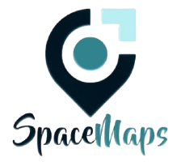

# 🚀 Space Maps

**Sistema de Localização para pessoas com deficiência visual**



## 📋 Sobre o Projeto

O **Space Maps** é um sistema inovador de localização indoor desenvolvido especialmente para pessoas cegas e com baixa visão. O projeto visa garantir autonomia, segurança e inclusão em ambientes internos através de tecnologia assistiva avançada.

### 🎯 Objetivo

Criar um dispositivo que permita às pessoas com deficiência visual navegar com segurança em espaços internos, fornecendo orientações precisas e em tempo real através de comandos de áudio.

## 🔧 Tecnologias Utilizadas

- **Hardware**: ESP32 com câmera integrada
- **Software**: Inteligência Artificial para reconhecimento de objetos
- **Interface**: Óculos inteligentes com feedback de áudio
- **Conectividade**: Bluetooth para integração com dispositivos móveis
- **Frontend**: HTML5, CSS3, JavaScript

## ✨ Principais Características

- 🎥 **Óculos com câmera**: Captura imagens do ambiente para análise em tempo real
- 🧠 **Processamento com ESP32**: Garante eficiência e conectividade com a IA
- 🤖 **Inteligência Artificial**: Reconhece objetos e mapeia o espaço
- 🔊 **Feedback via áudio**: Fornece instruções claras e acessíveis ao usuário
- ♿ **Foco na acessibilidade**: Projetado para atender às necessidades específicas
- 📱 **Conectividade Bluetooth**: Integração com celulares para personalização
- 🔌 **Funcionamento offline**: Sistema funciona sem necessidade de internet

## 🏗️ Arquitetura do Sistema


[Descrição da imagem](arquitetura.png)


## 📁 Estrutura do Projeto

```
spacemaps/
├── 📄 index.html          # Página principal
├── 📄 contato.html        # Página de contatos
├── 🎨 styles.css          # Estilos e tema espacial
├── 🖼️ logo.png            # Logo do projeto
├── 📚 README.md           # Documentação do projeto
└── 📋 Metodologia SCRUM/
    ├── Product Backlog
    ├── Sprint Backlog
    ├── Sprint Review
    └── Sprint Retrospective
```

## 👥 Equipe de Desenvolvimento

| Nome | Função | E-mail |
|------|--------|--------|
| **Michael Douglas Figueirôa dos Santos** | Desenvolvedor | michael_douglasfs@hotmail.com |
| **Pedro Silva Carvalho** | Desenvolvedor | pedro.carvalho@email.com |
| **Thadio Robledo Queiroz Oliveira** | Desenvolvedor | thadio.oliveira@email.com |
| **Thiago Roberto Soares Martins** | Desenvolvedor | gestaothg2.0@gmail.com |
| **Tiago Damião dos Santos** | Desenvolvedor | tiagodf4@gmail.com |
| **Suel Marques Albuquerque** | Desenvolvedor | Suel138612@gmail.com |

## 🏃‍♂️ Metodologia SCRUM

Este projeto segue a metodologia **SCRUM** para desenvolvimento ágil:

### 📋 Product Backlog
- Implementação de instruções de áudio em tempo real
- Sistema de reconhecimento de obstáculos
- Interface com alto contraste para baixa visão
- Conectividade Bluetooth com dispositivos móveis
- Sistema de mapeamento de ambientes internos
- Funcionamento offline

### 🎯 Sprint Backlog Atual
- [x] Configuração do módulo ESP32
- [x] Desenvolvimento do algoritmo de IA
- [x] Sistema de saída de áudio
- [x] Interface de alto contraste
- [ ] Integração Bluetooth
- [ ] Sistema offline
- [ ] Testes em ambiente controlado

## 🚀 Como Executar

### Pré-requisitos
- Navegador web moderno
- Servidor web local (opcional)

### Instalação
1. Clone o repositório:
```bash
git clone https://github.com/spacemapslocal/spacemaps.git
```

2. Navegue até o diretório:
```bash
cd spacemaps
```

3. Abra o arquivo `index.html` no navegador ou use um servidor local:
```bash
# Usando Python
python -m http.server 8000

# Usando Node.js
npx serve .
```

4. Acesse `http://localhost:8000`

## 🎨 Características Visuais

- **Tema Espacial**: Design com fundo estrelado e animações suaves
- **Cores Acessíveis**: Paleta de cores com alto contraste
- **Design Responsivo**: Adaptável a diferentes tamanhos de tela
- **Navegação Intuitiva**: Menu organizado e fácil navegação
- **Tipografia Clara**: Fontes legíveis e hierarquia visual bem definida

## 📈 Roadmap do Projeto

- **Fase 1** ✅ - Desenvolvimento da interface web
- **Fase 2** 🔄 - Prototipagem do hardware (ESP32 + Câmera)
- **Fase 3** 📋 - Desenvolvimento da IA de reconhecimento
- **Fase 4** 📋 - Integração hardware/software
- **Fase 5** 📋 - Testes com usuários reais
- **Fase 6** 📋 - Produção e distribuição

## 🤝 Como Contribuir

1. Faça um fork do projeto
2. Crie uma branch para sua feature (`git checkout -b feature/AmazingFeature`)
3. Commit suas mudanças (`git commit -m 'Add some AmazingFeature'`)
4. Push para a branch (`git push origin feature/AmazingFeature`)
5. Abra um Pull Request

## 📞 Contato

- **E-mail Geral**: spacemaps2025@gmail.com
- **GitHub**: [spacemapslocal/spacemaps](https://github.com/spacemapslocal/spacemaps)
- **Website**: [Página do Projeto](https://spacemapslocal.github.io/spacemaps)

## 📄 Licença

Este projeto é desenvolvido como parte de um trabalho acadêmico sobre metodologia SCRUM.

## 🙏 Agradecimentos

- Comunidade de desenvolvedores de tecnologia assistiva
- Organizações que apoiam a inclusão digital
- Usuários que forneceram feedback durante o desenvolvimento

---

<div align="center">
  <p><strong>Space Maps © 2025 - Equipe 3A Senac</strong></p>
  <p>Sistema de Localização para pessoas com deficiência visual</p>
  
  [](https://github.com/spacemapslocal/spacemaps)
  [](https://spacemapslocal.github.io/spacemaps)
</div>
